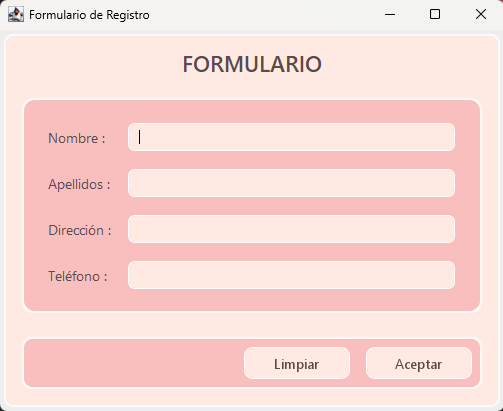
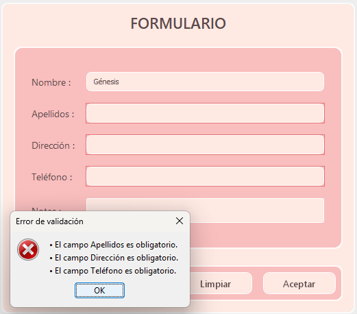
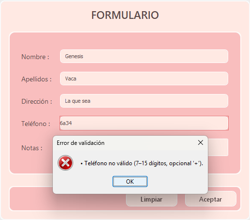
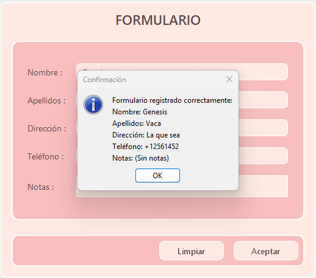
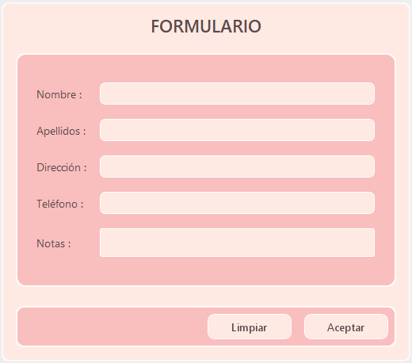

# 🎨 Neomorphic User Form – Java Swing  

<p align="center">
  
  
  
  
  
</p>

A **pastel neomorphic registration form** built entirely with pure Java Swing, featuring smooth 3D effects, soft shadows, and full data validation — now enhanced with **TXT file saving** for persistent user storage.

> *✨ A modern desktop interface combining UI aesthetics and functional backend logic.*

## 🌸 Overview

This project implements a **user creation form** (`NeumorphicForm`) developed as part of the *Interfaces Development* module.
It demonstrates GUI design, input validation, accessibility, and file handling in a standalone Java application.

## 🧩 Key Features

- #### 💾 Save to TXT file (`usuarios_registrados.txt`)
Appends each user entry to a readable text file for persistent storage.

- #### 🧠 Real-time validation
Highlights empty or incorrect fields and prevents submission until corrected.

- #### ☕ Pure Java (no dependencies)
Built entirely with Swing and AWT, without external libraries.

- #### 📝 Optional Notes Field
Multiline input for comments, maintaining the same rounded soft UI style.

- #### 🧹 Reset Button
Clears all fields and restores the form to its initial state.

- #### 🖼️ Neomorphic Pastel Design
Inspired by *Soft UI* principles with subtle shadows and a calm peach-pink palette.

- #### ♿ Accessibility & Usability

  - “Enter” triggers the Save button

  - Tooltips on hover

  - Visual focus indicators

  - Centered adaptive layout

## 🧠 System Requirements

| Requirement | Description                             |
| ----------- | --------------------------------------- |
| Java JDK    | 17 or higher                            |
| OS          | Windows 10/11, macOS, or Linux          |
| IDE         | IntelliJ IDEA, Eclipse, or any Java IDE |
| Screen      | Minimum resolution: 1366×768            |
| Execution   | `java -jar NeumorphicForm.jar`          |

## 🧰 Tech Stack

| **Category**     | **Tools**                               |
| ---------------- | --------------------------------------- |
| **Language**     | Java 17                                 |
| **UI Framework** | Swing / AWT                             |
| **Design Style** | Neumorphism (Soft UI)                   |
| **Output File**  | Plain text (`usuarios_registrados.txt`) |
| **IDE Used**     | IntelliJ IDEA                           |

## 📋 Data Validation Rules

| Field   | Requirement                          | On Error                   |
| ------- | ------------------------------------ | -------------------------- |
| Name    | Required                             | Red border + error message |
| Surname | Required                             | Red border + error message |
| Address | Required                             | Red border + error message |
| Phone   | Required, 7–15 digits (optional “+”) | Error message + red border |
| Notes   | Optional                             | No validation              |


### ✅ If all fields are valid, data is saved in a readable structured format in a `.txt` file:
```
Nombre: Ana
Apellidos: Pérez García
Dirección: Calle Falsa 123
Teléfono: +34600111222
Notas: (Sin notas)
--------------------------
```

### 💾 File Generation

Once validation passes, a record is appended to:
```
/resources/usuarios_registrados.txt
```

If the file doesn’t exist, it is automatically created.
If an error occurs (permissions, missing path), a popup error message appears.

## 🧼 Buttons & Functionality

| Button              | Description                                                       |
| :------------------ | :---------------------------------------------------------------- |
| **Grabar (Save)**   | Validates data and saves the record to `usuarios_registrados.txt` |
| **Limpiar (Clear)** | Clears all input fields and resets focus to “Nombre”              |

## 🎨 Design Palette (Peach-Pink Theme)

| Element        | Color     | Description        |
| :------------- | :-------- | :----------------- |
| `BASE`         | `#FFE9E3` | Main background    |
| `ACCENT`       | `#F9BEBE` | Panels and buttons |
| `TEXT_DARK`    | `#5A4A4A` | Text contrast      |
| `SHADOW_DARK`  | `#E0B3B3` | Lower shadow       |
| `SHADOW_LIGHT` | `#FFFFFF` | Upper light effect |

## 🖼️ Preview Gallery

| Stage             | Image                                          |
| :---------------- | :--------------------------------------------- |
| Initial Form      |                    |
| Validation Errors |                |
| Invalid Phone     |      |
| Confirmation      |    |
| Saved TXT Output  |  |
| Registered users  |        |

## 🧭 Repository Structure
```
Neomorphic-Form/
│
├── docs/                          # Screenshots and documentation
│   ├── 01-home.png
│   ├── 02-errors.png
│   ├── 05-confirmation.png
│   ├── 06-cleared-peach.png
│   └── 07-saved.data.png
│
├── resources/
│   └── usuarios_registrados.txt

├── src/
│   └── edu.thepower.desarrollointerfaces/
│       └── formulario/
│           └── NeumorphicForm.java
│
├── manual/
│   └── Manual_Usuarios_RosaPastel__Version_2.0_GenesisVacaPalma.docx.pdf
│
└── README.md
```
## 🚀 How to Run

**1.** Clone the repository:
```
git clone https://github.com/genesisvaca/Neomorphic-Form.git
```

**2.** Open in your preferred IDE (e.g., IntelliJ IDEA).

**3.** Run the `NeumorphicForm` main class.

**4.** Fill out the form and press Grabar to save a record to `usuarios_registrados.txt`.

## 🌟 Author
#### 👩‍💻 Génesis Vaca Palma
📍 *Madrid, Spain*

📧 [genesisvacapalma@gmail.com](mailto:genesisvacapalma@gmail.com)  

🔗 [LinkedIn Profile](https://www.linkedin.com/in/genesisvacapalma/)
